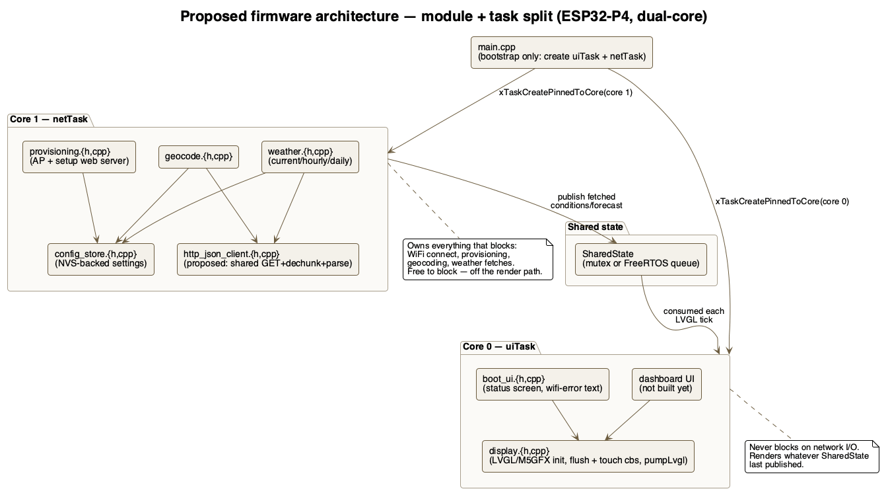
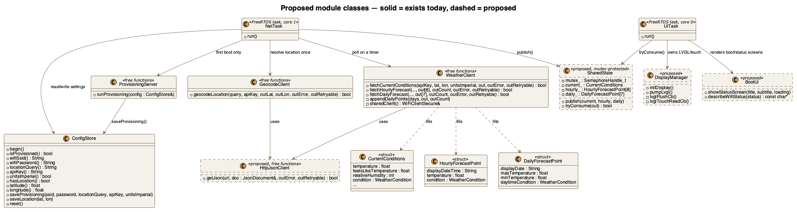
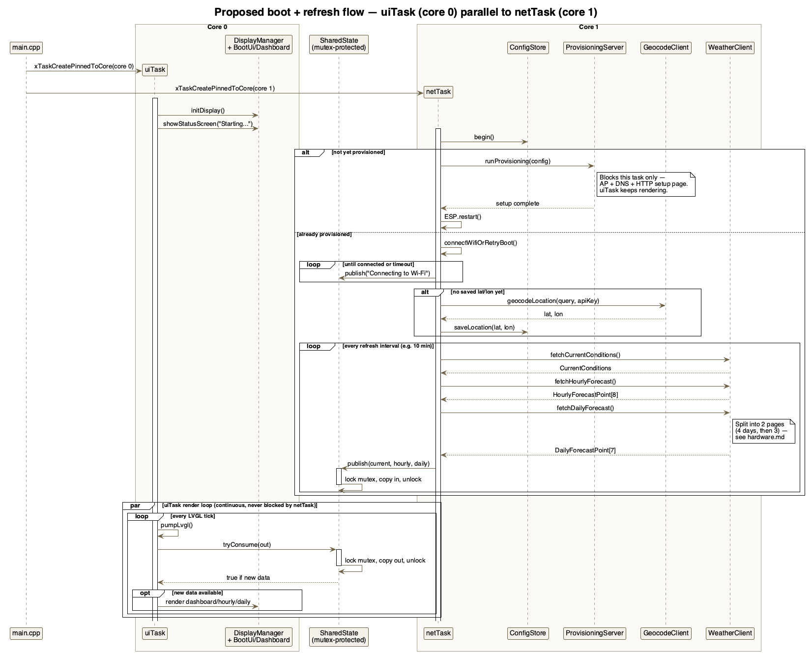

# Firmware architecture: modularity, memory, and concurrency

Research notes from investigating the `sdio_rx_get_buffer`/`esp-aes` crashes
(see [hardware.md](hardware.md)) that grew into a broader look at how the
firmware is structured — current module boundaries, whether JSON parsing has
to live on the heap, and whether the boot sequence should be split across
the P4's two cores. Nothing below is implemented yet except where noted;
this is the research to work from before making those changes.

## Block diagram — proposed module + task split

Source: [diagrams/block-diagram.puml](diagrams/block-diagram.puml) (rendered
with [PlantUML](https://plantuml.com)).

## Current module map

| File | Owns |
|------|------|
| `src/main.cpp` | Boot orchestration only: display bring-up, WiFi connect + retry, location/timezone resolution, the netTask refresh loop, and creating `uiTask`/`netTask` — no LVGL calls of its own (see the module split below, now implemented) |
| `src/display.cpp` / `include/display.h` | `initDisplay()`, `lvglFlushCb`, `lvglTouchReadCb`, `pumpLvgl()` — pure LVGL/M5GFX plumbing |
| `src/boot_ui.cpp` / `include/boot_ui.h` | `showStatusScreen()` — the boot/connecting/error screen, rebuilt from scratch on every call (rare, simple) |
| `src/dashboard_ui.cpp` / `include/dashboard_ui.h` | The Dashboard screen (`docs/mockups/dashboard.html`): built once, updated in place on every refresh — statusbar, current-conditions/hi-lo/metrics, 7-day outlook, 8-hour strip. Uses `src/dashboard_fonts/` (generated, see `tools/gen_dashboard_fonts.sh`) |
| `src/shared_state.cpp` / `include/shared_state.h` | Mutex-protected hand-off between `netTask` and `uiTask`: `Status` (boot text) and `DashboardSnapshot` (current/hourly/daily + sync time + display location + units + UTC offset), each with its own `publish*()`/`tryConsume*()` pair |
| `src/config_store.cpp` / `include/config_store.h` | NVS-backed settings (WiFi, location incl. resolved city/state, API key, resolved lat/lon, resolved timezone offsets) |
| `src/geocode.cpp` / `include/geocode.h` | One-shot call to the Maps Geocoding API — resolves lat/lon **and** city/state from `address_components` |
| `src/timezone_lookup.cpp` / `include/timezone_lookup.h` | One-shot call to the Maps Time Zone API — resolves `rawOffset`/`dstOffset` seconds for the dashboard clock |
| `src/weather.cpp` / `include/weather.h` | Three calls to `weather.googleapis.com` (current/hourly/daily) |
| `include/geocode_parse.h`, `include/timezone_parse.h`, `include/weather_parse.h` | Arduino-free: each endpoint's JSON filter + arena-size constant, shared by the production `.cpp` above and `test/` (see [platformio-and-ci.md](platformio-and-ci.md)) |
| `src/provisioning.cpp` / `include/provisioning.h`, `include/provisioning_page.h` | First-run AP + setup web server |

The per-API modules (`config_store`, `geocode`, `weather`, `provisioning`)
are already reasonably separated. Two concrete issues found on closer look:

### 1. `geocode.cpp` and `weather.cpp` each hand-roll the same HTTP-GET-then-parse-JSON pattern — and have quietly diverged

Both do: `WiFiClientSecure` + `HTTPClient`, `GET`, check `HTTP_CODE_OK`,
`deserializeJson`, map the API's error shape to a human string + retryable
flag. But they diverged on the one detail that actually matters on this
hardware:

- `weather.cpp`'s `getJson()` deliberately uses `http.getString()` — chosen
  *because* `weather.googleapis.com` returns chunked transfer-encoding, and
  `http.getStream()` hands back the chunk markers un-decoded (confirmed on
  hardware as the cause of an earlier `InvalidInput` parse failure).
- `geocode.cpp` still calls `deserializeJson(doc, http.getStream())`
  directly. It happens to work today, presumably because the Geocoding API
  response isn't chunked (has a `Content-Length`) — but that's incidental,
  not verified, and it's exactly the kind of divergence that bites later if
  Google ever changes that endpoint's transfer encoding.

**Recommendation:** extract a shared `http_json_client.{h,cpp}` with one
`getJson(url, doc, outError, outRetryable)` (the `getString()`-based,
dechunking-safe version) used by both callers. Each module keeps its own
error-vocabulary mapper (`describeError`/`describeStatus`) since those are
genuinely API-specific (Google Cloud's `{"error": {...}}` envelope vs.
classic Maps' top-level `status` field) — only the transport plumbing should
be shared.

### 2. `main.cpp` mixes five concerns that will conflict once the real dashboard exists

Today it's fine because everything runs once at boot, in order, on the one
Arduino `loopTask`. But the README's last unchecked item is wiring up the
actual dashboard/hourly/daily/alert screens, and once there's a persistent
UI instead of a one-shot boot sequence, `main.cpp` needs to stop being
"init display, then run a linear boot script, then occasionally repaint."

**Recommendation**, split along the same lines the [concurrency
section](#concurrency-should-boot-io-and-ui-share-one-task) below argues
for anyway:

- `display.{h,cpp}` — `initDisplay()`, `lvglFlushCb`, `lvglTouchReadCb`,
  `pumpLvgl()`. Pure LVGL/M5GFX plumbing, no boot logic.
- `boot_ui.{h,cpp}` — `showStatusScreen()`, `describeWifiStatus()`. Screen
  rendering, no networking.
- `main.cpp` — orchestration only: calls into the above plus
  `config_store`/`geocode`/`weather`/`provisioning`, no LVGL calls of its
  own.

This isn't just tidiness — it's what makes the task split below possible:
you can't cleanly move "the networking half" to its own FreeRTOS task while
it's interleaved with direct LVGL calls in the same functions.

### Class diagram — proposed modules

Solid-outline classes exist today; dashed-outline ones (`HttpJsonClient`,
`SharedState`, `DisplayManager`, `BootUi`) are proposed. Source:
[diagrams/class-diagram.puml](diagrams/class-diagram.puml).

## Memory: does JSON parsing have to be on the heap?

Prompted by the `esp-aes: Failed to allocate memory for start alignment
buffer` crash (see hardware.md) — the AES-GCM DMA path and our own
`String`/`JsonDocument` allocations compete for the same scarce
internal/DMA-capable RAM pool, since ESP32-Arduino's `malloc()` only routes
to PSRAM above roughly a 16KB threshold, and our JSON documents are a few KB
each.

Checked against the vendored ArduinoJson v7 source
(`.pio/libdeps/tab5/ArduinoJson/src/ArduinoJson/Memory/`):

- **`Allocator`** (`Allocator.hpp`) is a pluggable interface —
  `allocate`/`deallocate`/`reallocate` — passed to `JsonDocument`'s
  constructor (`JsonDocument doc(&myAllocator)`, per
  `Document/JsonDocument.hpp:24`). So handing it a stack- or
  arena-backed allocator instead of the default `malloc`/`free` one is
  fully supported.
- **It's not one allocation, though.** `ResourceManager` drives two pools:
  - Variant nodes (`MemoryPoolList`/`MemoryPool.hpp`) grow in fixed chunks —
    on this 32-bit target, `ARDUINOJSON_POOL_CAPACITY` is 128 slots × 8
    bytes = **1024 bytes/pool** (`Configuration.hpp:118`), a new pool
    allocated (one `allocate()` call) whenever the current one fills.
  - Strings (`StringNode.hpp`) get **one `allocate()` per unique string
    value** (condition type, description, icon URI, wind cardinal, ...),
    and — the part that matters for a naive stack allocator —
    `StringNode::resize()` calls `reallocate()` as the parser streams in
    more characters, so a single parse issues many alloc/realloc calls, not
    one.
- **Implication:** a plain bump allocator (hand out from a fixed local
  array, never actually free) works fine for the append-only variant pools,
  but `reallocate()` on strings needs to know each block's prior size to
  copy correctly on growth — a bump allocator needs a small per-block size
  header plus "grow in place if it's the last allocation, else copy and
  re-bump" logic to implement that correctly. Standard arena-allocator
  technique, not exotic, but real implementation work — not a drop-in.
- **Sizing:** `JsonDocument::memoryUsage()` looked like the obvious way to
  measure this — it isn't. It's deprecated in the pinned ArduinoJson
  version (7.4.3) and unconditionally returns 0 (`JsonDocument.hpp:389`).
  `json_arena_allocator.h`'s `JsonArenaAllocator` tracks its own
  `bytesUsed()` instead, which is what's actually logged after every parse
  now.
- **Where would that arena live?** A local (function-scope) array is stack
  memory in whichever task calls it. Confirmed in the Arduino-ESP32 core
  (`cores/esp32/main.cpp:15-21`): `setup()`/`loop()` run in a task called
  `loopTask`, created with an **8192-byte stack by default**. The
  seemingly obvious way to grow it — a `-DCONFIG_ARDUINO_LOOP_STACK_SIZE`
  build flag — turned out not to work on this precompiled-libs target: the
  prebuilt `framework-arduinoespressif32-libs` package for this board ships
  an unconditional `#define CONFIG_ARDUINO_LOOP_STACK_SIZE 8192` in its own
  `sdkconfig.h` (no `#ifndef` guard), which silently wins over the
  command-line `-D` regardless of include order (confirmed by the
  compiler's own "redefined" warning when this was tried). The core
  exposes a weak `getArduinoLoopTaskStackSize()` function for exactly this
  instead (`cores/esp32/main.cpp:39-41`) — overriding that in `main.cpp` is
  what actually takes effect.

**Implemented:** `JsonArenaAllocator`/`StackJsonDocument`
(`include/json_arena_allocator.h`) and a `getArduinoLoopTaskStackSize()`
override (16KB) in `main.cpp`, used by all four JSON parses across
`weather.cpp`/`geocode.cpp`. Each logs its arena's `bytesUsed()` and
`overflowed()` after every real parse, so the current 6KB
(weather)/2KB (geocode) sizes are backed by hardware numbers, not the
original guess — worth checking the first few boots' Serial output after
flashing to confirm neither ever reports `overflowed=1`. Done after the
module split above, matching the original sequencing note: the
allocator can live with the networking code it serves instead of bolted
onto `weather.cpp` in isolation.

## Concurrency: should boot I/O and UI share one task?

The P4 is confirmed dual-core RISC-V (`hardware.md`), not just
FreeRTOS-cooperative on one core — genuine parallelism is available, not
just avoiding stalls.

Today everything — display init, WiFi connect, geocode, three weather
fetches — runs sequentially on the single Arduino `loopTask` (pinned via
`ARDUINO_RUNNING_CORE`). LVGL only stays responsive during the *artificial*
wait loops already in `main.cpp` (`while (millis() - start < X) { pumpLvgl();
delay(20); }`) — during the actual blocking calls themselves (`http.GET()`,
`getString()`, the TLS handshake), nothing pumps LVGL at all. Invisible today
only because there's no persistent dashboard yet; once refreshes happen
against a live UI (the README's next milestone), every refresh would freeze
it for however long the fetch takes.

**Proposed split:**

- **`uiTask`** (core 0) — owns LVGL/touch, runs continuously, never blocks
  on network I/O.
- **`netTask`** (core 1, `xTaskCreatePinnedToCore`) — owns WiFi,
  provisioning, and weather fetches; free to block since it's off the
  render path.
- Hand-off via a small mutex-protected result struct or a FreeRTOS queue,
  replacing the current pump-inside-every-wait-loop pattern.

### Sequence diagram — proposed boot + refresh flow

Source: [diagrams/sequence-diagram.puml](diagrams/sequence-diagram.puml).

**Implemented, with one correction found along the way: provisioning
stayed out of netTask.** `runProvisioning()` (`provisioning.cpp`) turned
out to own LVGL directly — its own screens (`lv_obj_create(nullptr)` +
`lv_screen_load()`), its own `lv_tick_inc()`/`lv_timer_handler()` pump
loop, servicing its captive-portal DNS/HTTP server the whole time. Moving
that onto netTask (core 1) while uiTask (core 0) independently calls
`lv_timer_handler()` would be two cores touching LVGL's internal state
at once — LVGL isn't thread-safe across cores without a lock around
every call, which this doesn't have. Provisioning is also a one-time,
single-task first-boot flow with nothing to parallelize against, so
there's no payoff to splitting it anyway. It stays synchronous in
`setup()`, before the split — the diagram above (drawn before this was
checked against the actual provisioning code) shows it inside netTask,
which is the one place this doc's proposal and the implementation
diverge.

What did land as designed:

- `SharedState` (`include/shared_state.h`, `src/shared_state.cpp`): a
  mutex-protected `Status{title, subtitle, loading}` with
  `publishStatus()`/`tryConsumeStatus()`, and — once the Dashboard screen
  existed to consume it — a second, same-shaped pair:
  `DashboardSnapshot{current, hourly[], hourlyCount, daily[], dailyCount,
  syncedAtUnix, displayLocation, unitsImperial, utcOffsetSec}` with
  `publishDashboard()`/`tryConsumeDashboard()`.
- `uiTaskFn` (core 0, **16KB stack**, bumped up from an initial 8KB):
  `M5.update()` + `pumpLvgl()` + `tryConsumeStatus()`/`tryConsumeDashboard()`
  → `showStatusScreen()`/`showDashboardScreen()`, forever. The 8KB starting
  size (matched to `netTaskFn`'s pre-dashboard estimate) held fine for the
  status screen, but hardware caught a `Guru Meditation Error: ... Stack
  protection fault` in this task once the hero temperature font grew to
  240px — LVGL's RLE decompression of a compressed glyph that large needs
  more of this task's stack than 8KB gives it (the panic's stack pointer
  sat exactly at the task's upper stack bound, the classic overflow
  signature). Doubled to 16KB, matching `netTaskFn`; no recurrence since.
- `netTaskFn` (core 1, 16KB stack — sized for the JSON arenas from the
  Memory section above): WiFi connect → geocode-if-needed →
  timezone-resolve-if-needed → `fetchDashboardSnapshot()` (current, hourly,
  and daily) → `publishDashboard()`, then **loops** on a 10-minute
  `delay(kRefreshIntervalMs)` rather than the one-shot
  `vTaskDelete(nullptr)` originally planned here — the Dashboard screen
  that motivated a refresh loop now exists. A failed fetch just logs and
  leaves the last published snapshot on screen (no revert to an error
  screen); rich offline/stale-data UX is out of scope until the status
  screen (mockup screen 4) gets built out further.
- The `getArduinoLoopTaskStackSize()` override added in the Memory phase
  became unnecessary and was removed: the JSON arenas now run inside
  `netTaskFn`'s own explicitly-sized 16KB stack, not the default Arduino
  `loopTask`. `setup()` itself now just brings up the display, runs
  provisioning if needed, creates the two tasks, and deletes its own
  task (`vTaskDelete(nullptr)`) — there's nothing left for the default
  `loopTask`/`loop()` to do.

## Related

- [hardware.md](hardware.md) — the `sdio_rx_get_buffer` / `esp-aes` crash
  investigations that prompted this
- [rendering.md](rendering.md) — the LVGL/M5GFX rendering approach the
  `uiTask` above would own
